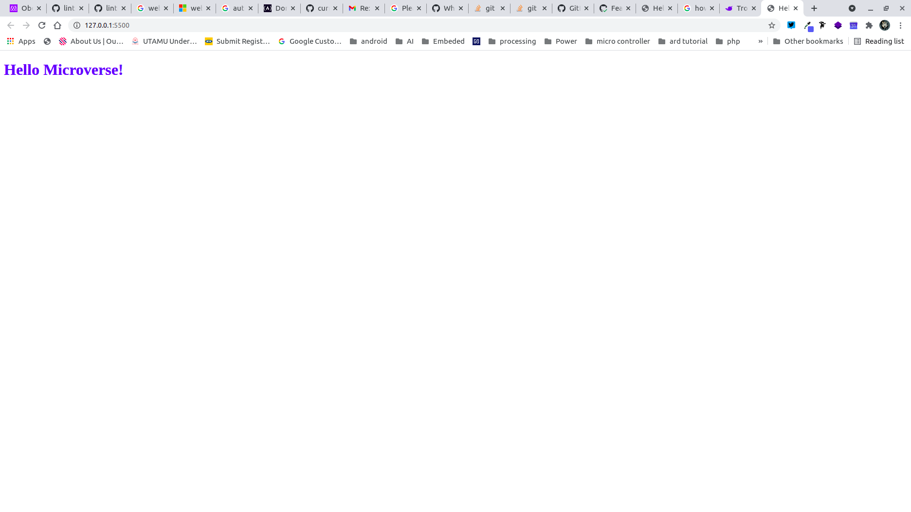

# Hello Microverse

> Project one module one

Additional description about the project and its features.

## Built With

- Major languages
HTML
CSS

## Live Demo

[Live Demo Link](https://livedemo.com)

### Setup
linters 
### Install
VS Code or any text editor

## Authors

👤 **Author1**

- GitHub: [@githubhandle](https://github.com/Obote)
- Twitter: [@obote_denis]https://twitter.com/Obote_denis)
- LinkedIn: [Obote Denis](https://www.linkedin.com/in/obote-denis-9859a2a3/)

## 🤝 Contributing

Contributions, issues, and feature requests are welcome!

Feel free to check the [issues page](../../issues/).

## Show your support

Give a ⭐️ if you like this project!

## Acknowledgments

My program partner Kaneez Fatima for helping out during the process.

## 📝 License

This project is [MIT](./MIT.md) licensed.
